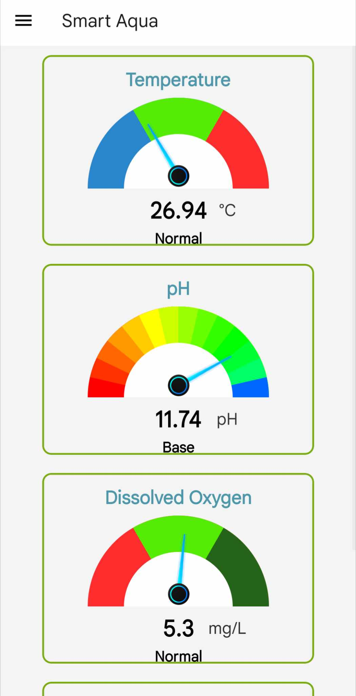

<p align="center">
  
</p>

<h1 align="center">  
  Capstone Project: SmartAqua
</h1>

<h4 align="center">An application integrating Internet of Things to monitor the water quality of the aquaponics.</h4>

<p align="center">
  <a href="#how-to-use">How To Use</a> •
  <a href="#user-interface">User Interface</a> •
  <a href="#download">Download</a> •
  <a href="#license">License</a>
</p>

## How To Use

To clone and run this application, you'll need [Git](https://git-scm.com) and [Node.js](https://nodejs.org/en/download/) (which comes with [npm](http://npmjs.com)) installed on your computer. From your command line:

```bash
# Clone this repository
$ git clone https://github.com/Paololalap/react-native-smart-aqua.git

# Go into the repository
$ cd SmartAqua

# Install dependencies
$ npm install

# Run the app
$ npm start
```

> **Note**
> If you're using Linux Bash for Windows, [see this guide](https://www.howtogeek.com/261575/how-to-run-graphical-linux-desktop-applications-from-windows-10s-bash-shell/) or use `node` from the command prompt.

## User Interface
<h3>Login Screen Interface</h3>
<p>
  
</p>

<h3>Home Page and Menu Drawer Interface</h3>
<p>
  
  
</p>

<h3>Real-time Monitoring Interface</h3>
<p>
  
</p>

<h3>Data Analysis Interface</h3>
<p>
  
</p>


## Download

You can [download](https://github.com/Paololalap/SmartAqua/blob/main/output/app.apk) the latest installable version of SmartAqua for Android.

## License

MIT

---

> [GitHub](https://github.com/Paololalap)
